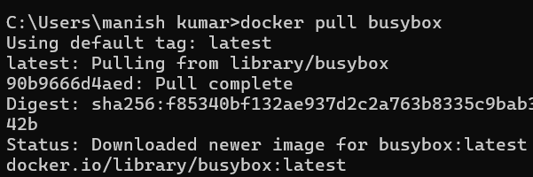
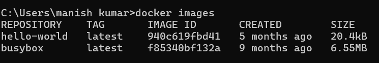
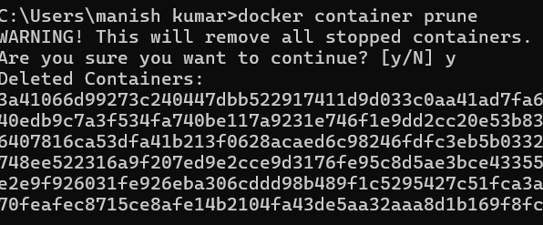

# Docker & Containerization Fundamentals - Week 4 Task 1

This document outlines the steps performed to understand the core concepts of containerization and Docker, and to demonstrate basic Docker commands.

---

### 1: Introduction to Containerization and Docker Fundamentals, Basic Commands

**Objective:**  
To identify and understand the core concepts of containerization and Docker, and to execute fundamental Docker commands.

---

### Actions performed:

1. **Explored Containerization Concepts:**  
   Learned about containerization, how it differs from virtual machines, and why Docker is preferred for lightweight, isolated, and reproducible application environments.

---

2. **Executed `docker run` command:**  
   To verify Docker installation and functionality:
   ```bash
   docker run hello-world
   ```
   

   ```bash
   docker run hello-world
   ```
   

---

3. **Pulled the BusyBox Image:**
   ```bash
   docker pull busybox
   ```
   

---

4. **Listed Docker Images:**
   ```bash
   docker images
   ```
   

---

5. **Ran a Command in BusyBox:**
   ```bash
   docker run busybox echo "Hello from BusyBox"
   ```
   

---

6. **Checked Running Containers (should be empty):**
   ```bash
   docker ps
   ```
   

---

7. **Listed All Containers (including stopped):**
   ```bash
   docker ps -a
   ```
   
   

---

8. **Ran an Interactive Ubuntu Container:**
   ```bash
   docker run -it ubuntu bash
   ```
   

---

9. **Exited & Stopped Ubuntu Container:**
   From within container:
   ```bash
   exit
   ```
   

---

10. **Removed a Stopped Container:**
   ```bash
   docker rm <container-id>
   ```
   

---

11. **Pruned All Exited Containers:**
   ```bash
   docker container prune
   ```
   

---

12. **Command Prompt Environment:**
   

---

13. **Application Setup Before Dockerization:**
   ```bash
   ls
   npm install express
   ```
     
   

---