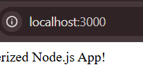

# Docker Image Creation from Dockerfile - Week 4 Task 2

This task focused on installing Docker, understanding how Dockerfiles work, building images from them, and handling common errors that arise during the process. I also got hands-on experience running a simple Node.js app inside a Docker container.

---

### 1: Docker Installation and Setup

**Objective:**  
To install Docker and ensure a proper environment to build and run containers.

Since I was using Windows, I installed Docker Desktop which provides Docker Engine and CLI. After installation, I verified it by running:

```bash
docker --version
```

Once Docker was running successfully, I proceeded to create a custom image. For this, I created a simple Dockerfile. 

---

### 2: Renaming Dockerfile Properly

While beginning, I had created a file named `dockerfile.txt` by mistake. Docker looks specifically for a file named `Dockerfile` (case-sensitive).

```bash
mv dockerfile.txt Dockerfile
```
  
This fixed the issue and allowed Docker to detect the file during build. 

---

### 3: Handling Dockerfile Not Found Error

Initially, I ran the build command and encountered this error:

```bash
docker build -t my-node-app .
```
  
  

These errors taught me the importance of naming conventions and correct directory structure. After renaming the Dockerfile, the build command ran successfully. 

---

### 4: Successful Build Process

After fixing the above issues, the build command finally worked and showed unpacking/building steps of my app:

```bash
docker build -t my-node-app .
```
  
This step installed dependencies and created an image based on instructions in the Dockerfile. 

---

### 5: Running the Built Image

To check if my containerized app works, I ran:

```bash
docker run -p 3000:3000 my-node-app
```
  
  

It showed the greeting message and worked correctly in the browser on `localhost:3000`. This confirmed that my Dockerized app is working as expected. 

---

### 6: Errors During Execution

While testing, I faced some issues like missing module errors and execution failures:

```bash
docker run my-node-app
```
  
  

These were caused due to missing modules or incorrect paths. I fixed them by updating the Dockerfile and ensuring all dependencies were included during build. 

---

### 7: Port Binding Error

Once, while running the app multiple times, I encountered this error:

```bash
docker run -p 3000:3000 my-node-app
```
  

This happened because the port was already in use by another container. I learned to stop the existing container or use another port. 

---

### 8: Final Build and Run Success

After resolving all issues, I ran the app again and confirmed that everything was working as expected:

```bash
docker build -t my-node-app .
docker run -p 3000:3000 my-node-app
```
  

This task helped me gain a clear understanding of the Docker build lifecycle, common issues, and how to run apps smoothly in containers. I'm now more confident in my ability to work with Docker and troubleshoot common problems. 

---

---

### 9: Combined View of Build → Run → Push → Output


---