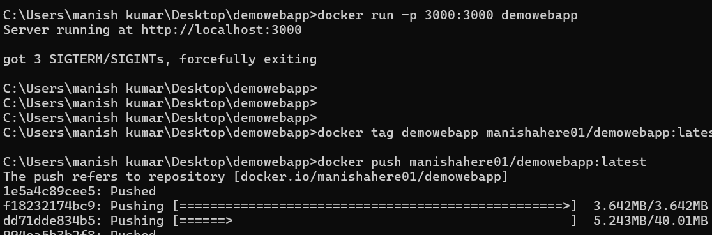
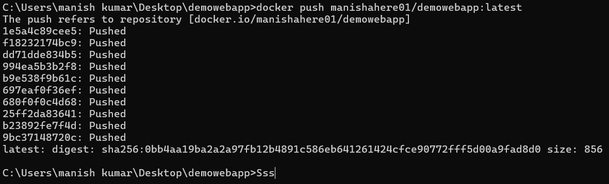
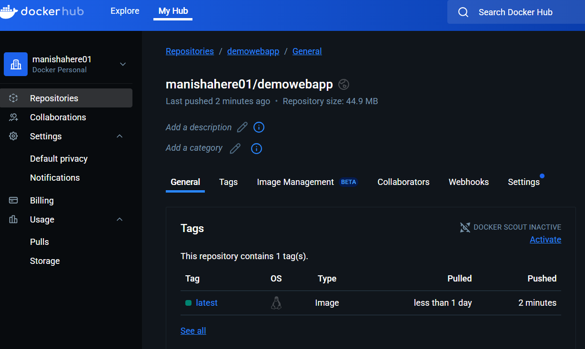
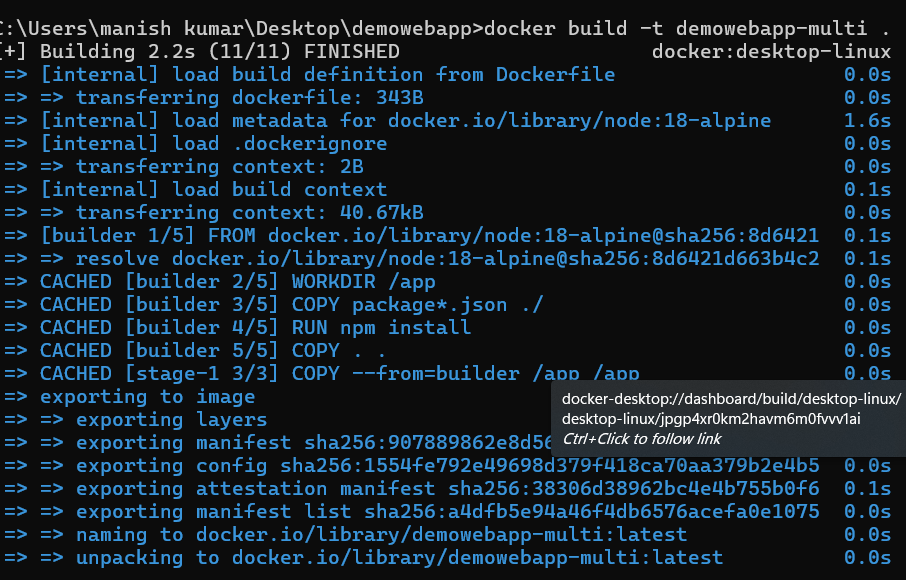
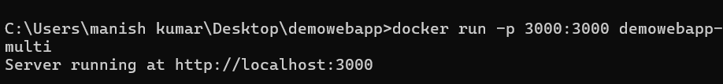

# DockerHub & Multi-Stage Builds - Week 4 Task 3

In this task, I explored Docker registries, learned how to tag and push images to DockerHub, and implemented multi-stage builds to optimize Docker images for production use. This step also introduced troubleshooting container execution and verifying success.

---

### 1: Login to DockerHub

**Objective:**  
Authenticate with DockerHub to push and pull images.

```bash
docker login
```
  
This image also includes tagging the image using:
```bash
docker tag demowebapp manishahere01/demowebapp
```
and starting the push operation.

---

### 2: Push Image to DockerHub

```bash
docker push manishahere01/demowebapp
```
  
Successfully pushed all layers of the image to DockerHub.

---

### 3: Verify on DockerHub Website

After the push, I visited my DockerHub account to verify.

  
This screenshot shows the demowebapp repo with the latest image available.

---

### 4: Multi-Stage Build for Optimization

I created a Dockerfile that uses multiple stages: a build stage and a production stage.

```bash
docker build -t demowebapp-multi .
```
  
The `[stage-1 3/3 COPY --from=builder /app /app]` line confirms this is a multi-stage build.

---

### 5: Running the Multi-Stage Built Container

```bash
docker run -p 3000:3000 demowebapp-multi
```

### 6: Successful Run of Multi-Stage Build

```bash
docker run -p 3000:3000 demowebapp-multi
```
  
Output showed: `Server running at http://localhost:3000`, confirming that everything works correctly.

---

This task taught me how to push images to DockerHub, implement multi-stage builds, and troubleshoot common runtime issues like port conflicts and container reuse.