# Docker Image Creation via Dockerfile and Running Container - Week 4 Task 4

In this task, I explored two different methods for creating Docker images:

1. By writing a `Dockerfile` and using the `docker build` command.
2. By modifying a running container and using `docker commit`.

---

## Method 1: Creating an Image from a Dockerfile (Nginx Example)

---

### Step 1: Set Up the Project Directory

```bash
mkdir my-ngnix-app
cd my-ngnix-app
```
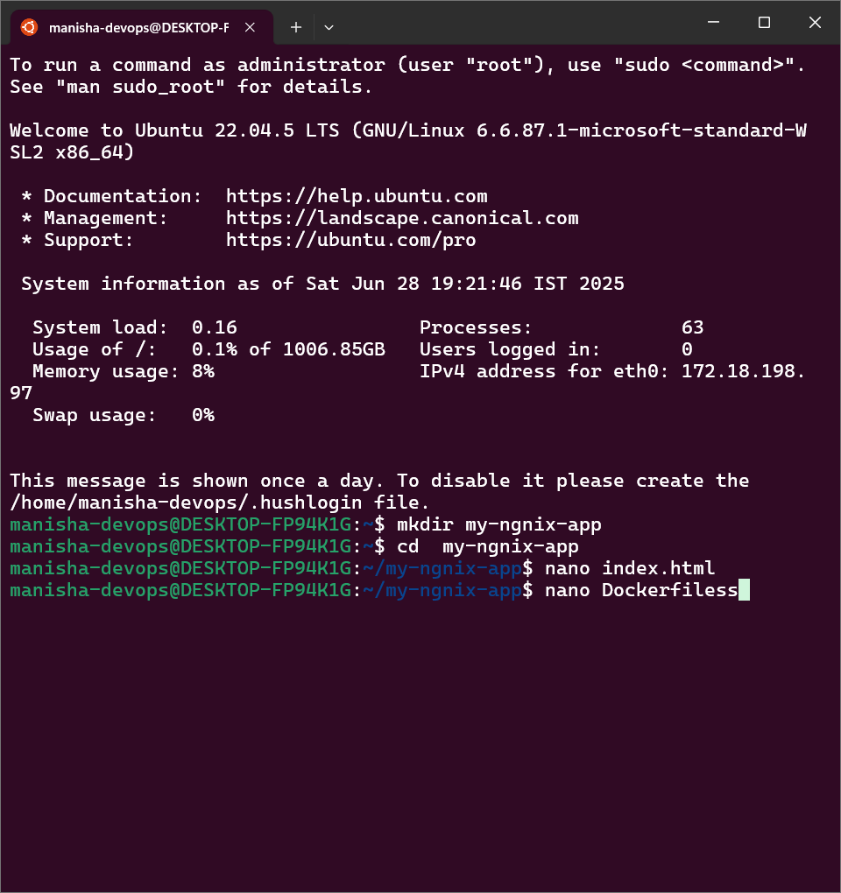  
Created a folder for the Nginx Docker app with `Dockerfile` and `index.html`. 

---

### Step 2: Write the Dockerfile

```bash
nano Dockerfile
```
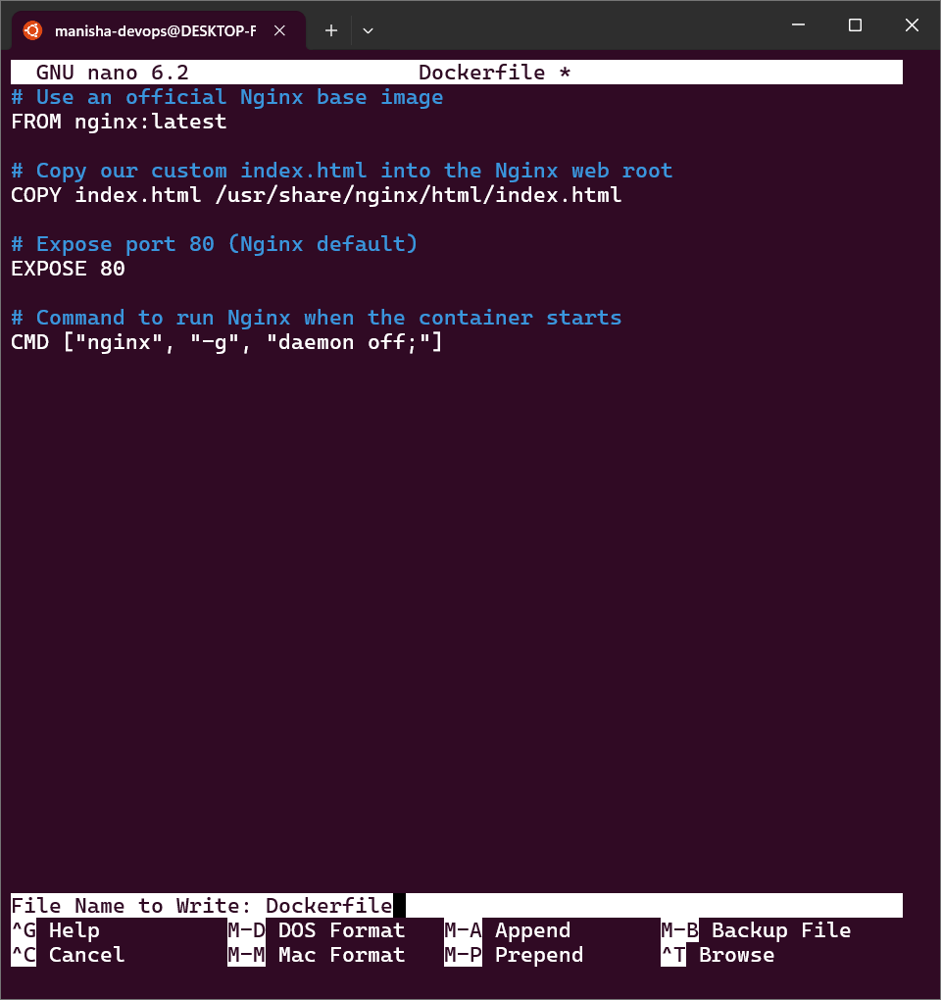  
Defined a simple Dockerfile to serve `index.html` using Nginx. The Dockerfile includes instructions to set the base image, copy the `index.html` file, and expose port 80. The `CMD` instruction specifies the default command to run when the container is started. In this case, it runs the Nginx server with the default configuration file (`nginx.conf`) and serves the `index.html` file.

---

### Step 3: Build the Docker Image

```bash
docker build -t my-custom-nginx-image .
```
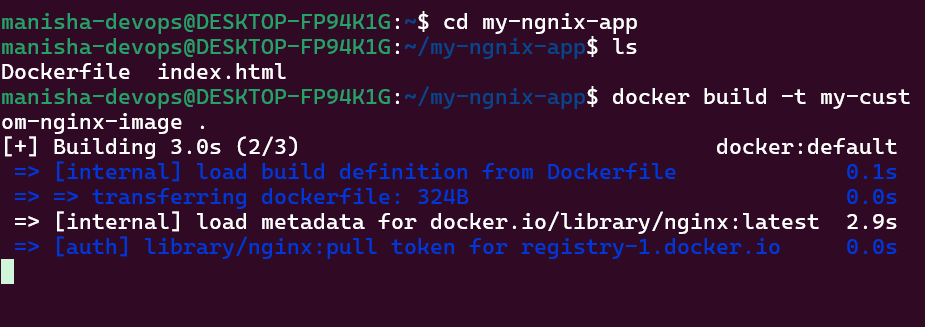  
Docker read the Dockerfile and created a new image named `my-custom-nginx-image`. The `.` at the end of the command tells Docker to build the image from the current directory. The `-t` flag specifies the name and tag of the image. In this case, the image is tagged with `my-custom-nginx-image`. 

---

### Step 4: Verify Docker Image Created

```bash
docker images
```
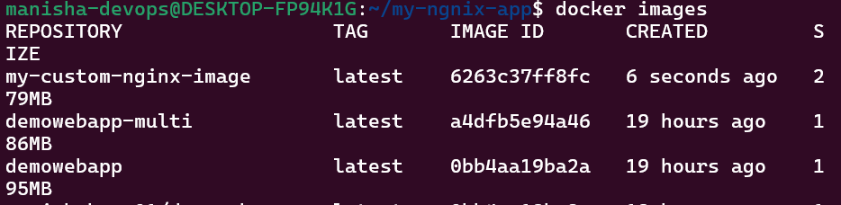

---

### Step 5: Run the Container

```bash
docker run -d -p 8080:80 --name my-nginx-container my-custom-nginx-image
```
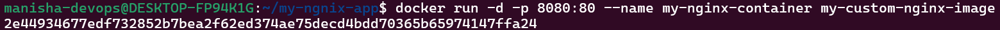  
Ran the container in detached mode, mapping port 8080 on host to port 80 inside container. The `--name` flag assigns a name to the container, and the `my-custom-nginx -image` is the name of the image to use. The `-d` flag runs the container in detached mode. The `-p` flag maps port 8080 on the host machine to port 80 inside the container. This allows us to access the Nginx server from the host machine.

---

### Step 6: View in Browser

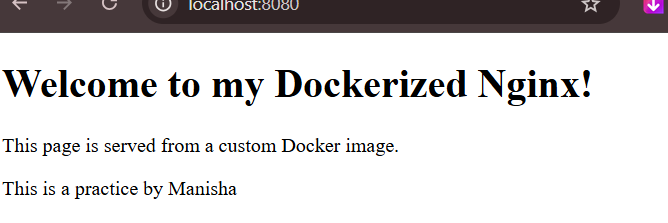  
Browser output shows HTML content served from the container. The Nginx server is successfully serving the `index.html` file from the container. The browser is accessing the Nginx server through the mapped port 8080 on the host machine. 

---

## Method 2: Create Image from Running Ubuntu Container (with htop)

---

### Step 1: Start Ubuntu Container

```bash
docker run -it --name my_temp_ubuntu_for_commit ubuntu:latest /bin/bash
```
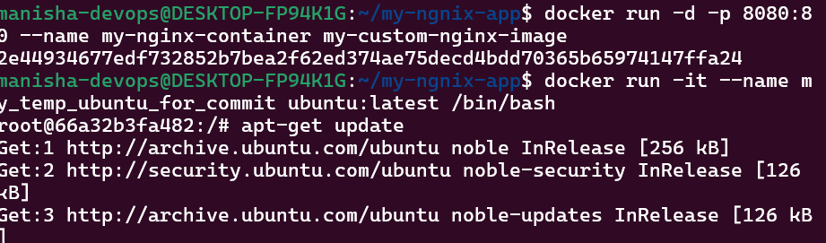

---

### Step 2: Update APT & Install htop

```bash
apt-get update
```
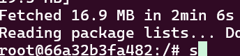  
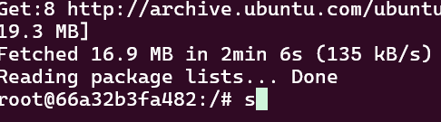

```bash
apt-get install -y htop
```
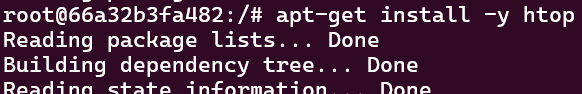  
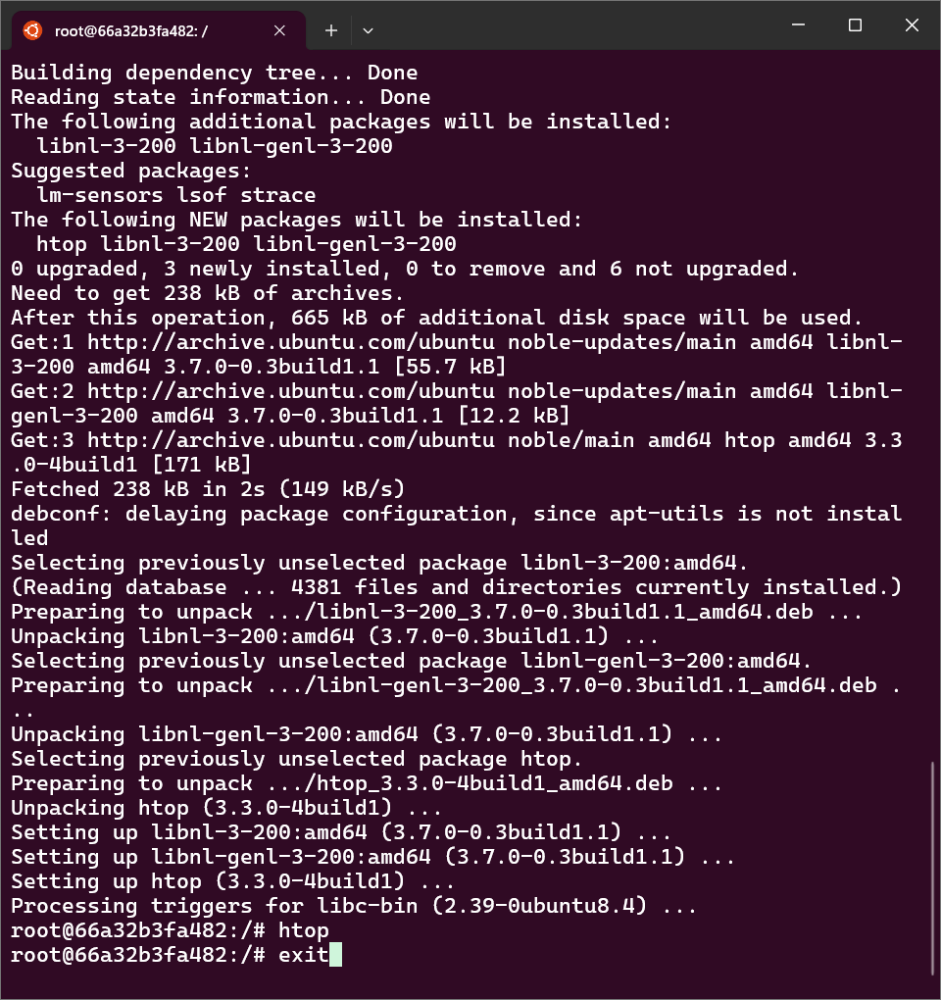

---

### Step 3: Exit Container

```bash
exit
```

---

### Step 4: Commit the Container to Create New Image

```bash
docker commit my_temp_ubuntu_for_commit my-ubuntu-with-htop:1.04
```
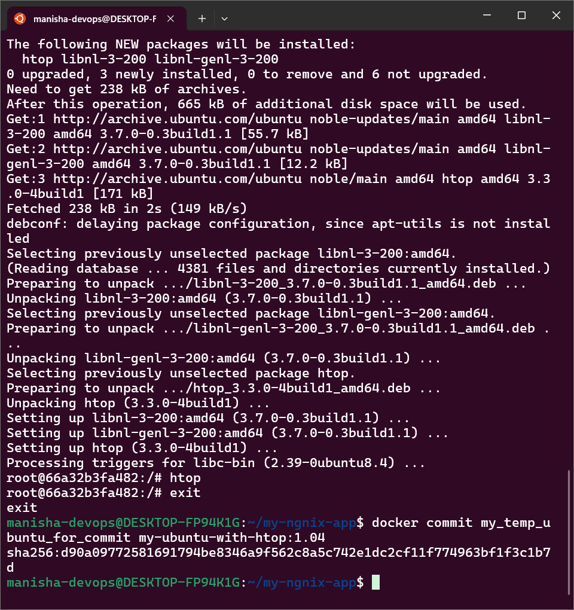  
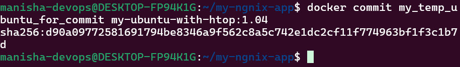

---

### Step 5: Verify Image is Created

```bash
docker images
```
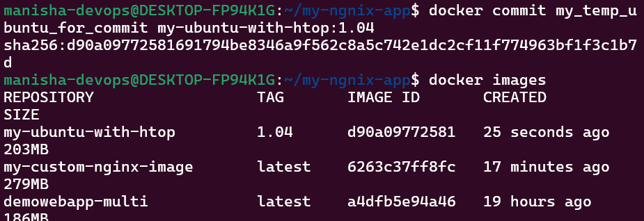

---

### Step 6: Run New Image & Verify htop

```bash
docker run -it my-ubuntu-with-htop:1.04 /bin/bash
```
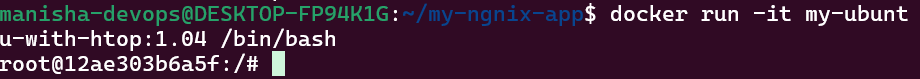

```bash
htop
```
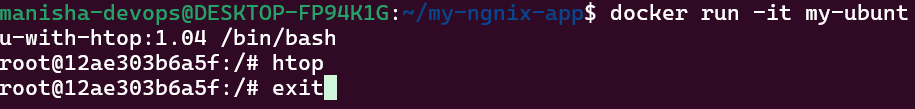

---

This task helped reinforce Docker image creation through two powerful techniques: declarative Dockerfiles and on-the-fly snapshots using `docker commit`. I also understood how to verify and troubleshoot image and container builds. The hands-on experience with `htop` and its installation on a temporary Ubuntu container further solidified my understanding of containerized environments and the importance of version control in Docker. 