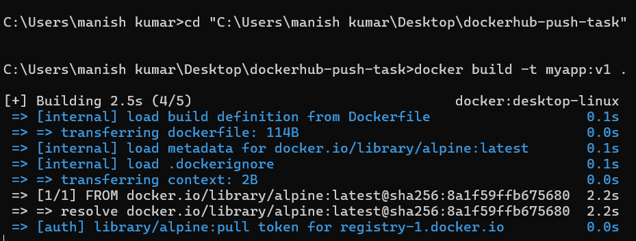
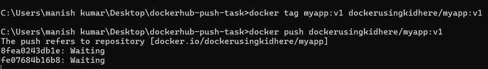
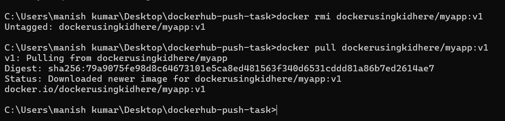
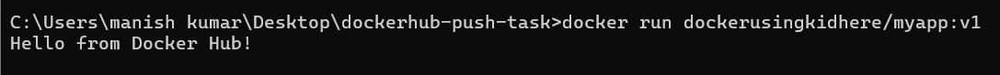

# Push and Pull Docker Image to Docker Hub - Week 3 Task 5

In this task, I learned how to build a Docker image from a project, tag it appropriately, push it to Docker Hub, pull it on a different machine, and run it. This demonstrated the complete cycle of Docker image distribution using Docker Hub, a widely-used container registry. The process involves creating a Dockerfile, building the image, tagging it, pushing it to Docker Hub , pulling it on another machine, and running it. This task is essential for developers who want to share their projects with others and collaborate on containerized applications.

---

## Step 1: Build Docker Image

```bash
cd dockerhub-push-task
docker build -t myapp:v1 .
```

  
This screenshot shows the process of building a Docker image using the Dockerfile. The image is tagged as `myapp:v1`. The output confirms successful image creation by showing build steps including pulling the base image and completing each instruction from the Dockerfile. The final line indicates the image has been successfully built with the specified tag. 

---

## Step 2: Tag and Push to Docker Hub

```bash
docker tag myapp:v1 dockerusingkidhere/myapp:v1
docker push dockerusingkidhere/myapp:v1
```

  
The image is tagged with your Docker Hub username and then pushed to Docker Hub. This makes the image accessible from anywhere via Docker Hub. The push process includes uploading all image layers. The output shows the progress of the push operation, including the upload of each layer and the final confirmation of a successful push. 

---

## Step 3: Pull the Image from Docker Hub

```bash
docker rmi dockerusingkidhere/myapp:v1
docker pull dockerusingkidhere/myapp:v1
```

  
The local image is removed to ensure a clean pull. Pulling the image from Docker Hub verifies that the push was successful and the image is now publicly available for use. The pull operation downloads the image layers from Docker Hub. The output shows the download progress and confirms the successful pull of the image. 

---

## Step 4: Run the Pulled Image

```bash
docker run dockerusingkidhere/myapp:v1
```

  
This confirms the image works as expected after pulling. The container runs and displays "Hello from Docker Hub!", completing the full lifecycle from build to deployment using Docker Hub. The output shows the container's output, confirming the application is running as expected. This demonstrates the successful distribution and deployment of the Docker image using Docker Hub. 

---

This task provided a practical understanding of how to share Docker images via Docker Hub. It demonstrated the workflow for building, tagging, pushing, pulling, and running container images — a crucial skill in modern DevOps practices. The process ensures that Docker images can be easily shared and reused across different environments, facilitating collaboration and efficient deployment of applications. 
