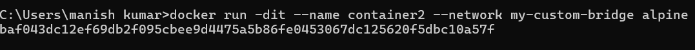

# Custom Docker Bridge Network - Week 4 Task 6

In this task, I learned about Docker networks, especially custom bridge networks. By creating a custom bridge, I enabled isolated communication between containers on the same network. This task also involved troubleshooting Docker service issues and testing container connectivity. I gained hands-on experience with Docker network commands and learned how to create, inspect, and delete networks. 

---

## Step 1: Docker Login and Daemon Issues

```bash
docker login
docker container ls
```

  
The Docker login was successful, but the following commands (`docker container ls`, `docker ps`) failed. This suggests the Docker daemon or the Linux Engine wasn’t running properly. Understanding such service dependencies is crucial when diagnosing Docker runtime issues. I restarted the Docker service to resolve the issue. 

---

## Step 2: Create a Custom Bridge Network

```bash
docker network create --driver bridge my-custom-bridge
```

  
Created a custom network named `my-custom-bridge` using the bridge driver. This allows Docker containers connected to this network to communicate with each other internally. The bridge driver is the default network driver in Docker, which creates a virtual network bridge on the host machine. This bridge connects the containers to the host network, enabling communication between them. 

---

## Step 3: Verify Network Creation

```bash
docker network ls
```

  
Verified that the custom bridge was successfully created. The `bridge` driver and `local` scope confirm that it's isolated and host-specific. This is a key aspect of custom bridge networks, ensuring that containers on the same network can communicate with each other but remain isolated from the host and other networks. 

---

## Step 4: Create Container 1 on the Bridge Network

```bash
docker run -dit --name container1 --network my-custom-bridge alpine
```

  
Created `container1` using the Alpine image and connected it to the custom bridge. The image was pulled from Docker Hub because it wasn’t available locally. This step demonstrates how to connect a container to a custom network, enabling it to communicate with other containers on the same network. 

---

## Step 5: Create Container 2 on the Bridge Network

```bash
docker run -dit --name container2 --network my-custom-bridge alpine
```

  
Created `container2` similarly and attached it to the same network, enabling it to communicate with `container1`. This step further demonstrates the flexibility of Docker networks, allowing multiple containers to be connected and communicate with each other.

---

## Step 6: Test Container-to-Container Communication

```bash
docker exec -it container1 sh
ping container2
```

  
Accessed `container1` and pinged `container2` by name. The successful responses confirm that containers on the same custom bridge can communicate using DNS-like container names. This validates that Docker’s internal DNS resolution is working on custom bridge networks. 

---

By the end of this task, I understood how to isolate services into their own virtual networks and how Docker’s networking system allows inter-container communication within those scopes. This is crucial for building complex, scalable, and secure applications using Docker. The custom bridge network created here serves as a foundation for more advanced networking configurations, such as overlay networks for distributed applications. 