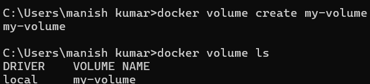
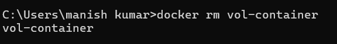

# Docker Volumes and Persistent Data - Week 4 Task 7

In this task, I explored how to use Docker volumes to store data persistently. Docker volumes are independent of container lifecycles, allowing data to survive container removal. This task demonstrated creating a volume, using it within a container, writing data, and validating its persistence after the container is deleted. 

---

## Step 1: Create a Docker Volume

```bash
docker volume create my-volume
docker volume ls
```

  
Created a Docker volume named `my-volume`. Listing volumes shows `my-volume` under the `local` driver, confirming its successful creation. Volumes serve as persistent data stores outside of the container filesystem. They are not deleted when a container is removed, making them ideal for storing data that needs to persist across container lifecycles. 

---

## Step 2: Run a Container with the Volume Attached

```bash
docker run -it --name vol-container -v my-volume:/data alpine sh
```

Inside the container:

```sh
echo "hello docker volume this is Manisha" > /data/hello.txt
cat /data/hello.txt
```

  
Started a container with the `my-volume` volume mounted at `/data`. Wrote a text file inside `/data`, and verified the content using `cat`. This confirms that data is being written to the persistent volume. The volume's persistence is a key feature of Docker volumes, allowing data to survive container removal. 

---

## Step 3: Remove the Container

```bash
docker rm vol-container
```

  
Removed the original container. This simulates a real-world scenario where a container might be stopped or deleted, but we want to retain its data. The volume's persistence ensures that the data remains intact even after the container is gone. 

---

## Step 4: Test Data Persistence by Reusing the Volume

```bash
docker run -it --rm -v my-volume:/data alpine sh
cat /data/hello.txt
```

  
Launched a fresh container with the same volume attached. The content written earlier is still available. This proves that Docker volumes persist data beyond the lifespan of a single container. The `--rm` flag is used to automatically remove the container after it exits, which is a common practice when testing or debugging. 

---

This task gave me hands-on insight into how Docker volumes work, and how they can be leveraged to build stateful containerized applications where data needs to persist even if containers are removed or recreated. The ability to attach volumes to containers and ensure data persistence is a powerful feature that simplifies the development and deployment of complex applications. 