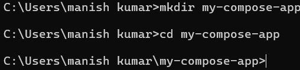
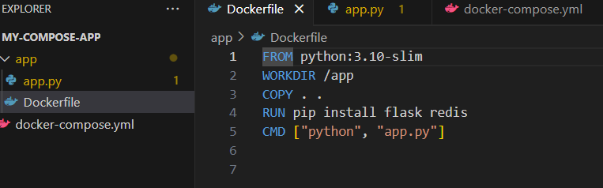
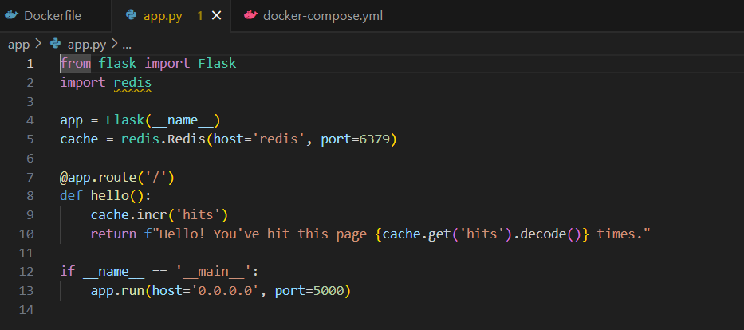
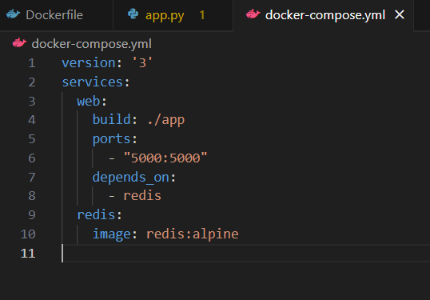
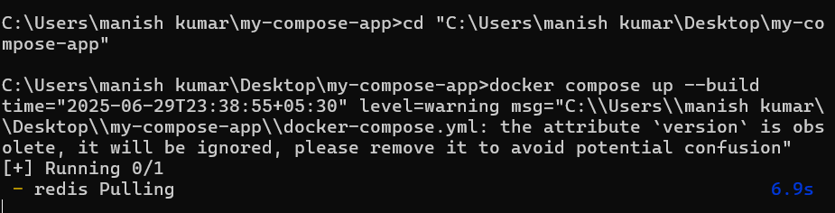
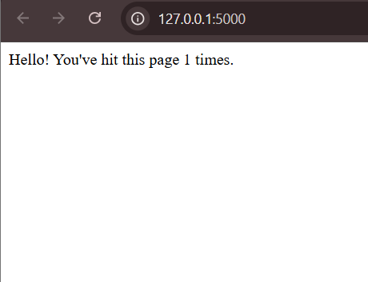
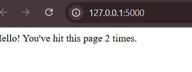
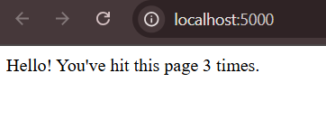

# Docker Compose: Multi-container Applications - Week 4 Task 8

In this task, I explored how to use **Docker Compose** to manage a multi-container application consisting of a **Flask web server** and a **Redis** database. Docker Compose simplifies orchestration by allowing you to define and run multi-container Docker applications with a single command using a YAML configuration file. This task demonstrated the complete setup, integration, and communication between the services. 

---

## Step 1: Set Up Project Directory

```bash
mkdir my-compose-app
cd my-compose-app
```

  
This screenshot shows the initial setup of your Docker Compose project. A new directory named `my-compose-app` is created and used as the working directory where all project files will reside. This is a standard practice for organizing Docker projects. The `cd` command is used to navigate into the newly created directory. 

---

## Step 2: Write the Dockerfile

```Dockerfile
FROM python:3.10-slim
WORKDIR /app
COPY . /app
RUN pip install flask redis
CMD ["python", "app.py"]
```

  
This Dockerfile defines how to build the Flask application's image. It installs the required dependencies and specifies how the application should run. The `python:3.10-slim` base image is used to reduce the image size. The `WORKDIR` command sets the working directory, and `COPY` copies the application code into the container. The `RUN` command installs the necessary packages, and `CMD` specifies the command to run when the container starts. This Dockerfile is a standard template for building Flask applications.

---

## Step 3: Write the Flask Application (app.py)

```python
from flask import Flask
import redis

app = Flask(__name__)
cache = redis.Redis(host='redis', port=6379)

@app.route('/')
def hello():
    count = cache.incr('hits')
    return f"Hello! You've hit this page {count} times."
```

  
This Python file defines the Flask application that increments a hit counter stored in Redis, showing the number of times the root URL has been accessed. The `redis` library is used to interact with the Redis database. The `incr` method is used to increment the counter, and the result is returned as a string. This application is a simple example of how Flask can interact with Redis.

---

## Step 4: Create docker-compose.yml

```yaml
version: '3'
services:
  web:
    build: .
    ports:
      - "5000:5000"
    depends_on:
      - redis
  redis:
    image: "redis:alpine"
```

  
This file sets up two services: a Flask web server and a Redis database. It allows the services to be started together and managed as a single unit. 

---

## Step 5: Build and Run the Application

```bash
docker compose up --build
```

  
This command builds the image, pulls the required Redis image, and starts both services. The console shows Redis being pulled and started, along with a deprecation warning for the Compose version. 

---

## Step 6: Access the Application in Browser

First Access:
  
The Flask app runs at `127.0.0.1:5000` and shows "Hello! You've hit this page 1 times." indicating successful deployment. Subsequent accesses show the hit count incrementing. 

Second Access:
  
After a page refresh, the counter increments to 2. This verifies that the Redis database is maintaining state. 

Third Access:
  
A third refresh confirms the counter reaches 3, showing persistent tracking across multiple requests. 

---

This task gave me a clear understanding of Docker Compose and how it simplifies running multi-service applications. It demonstrated container communication, orchestration, and persistent state management between web and database containers. 
